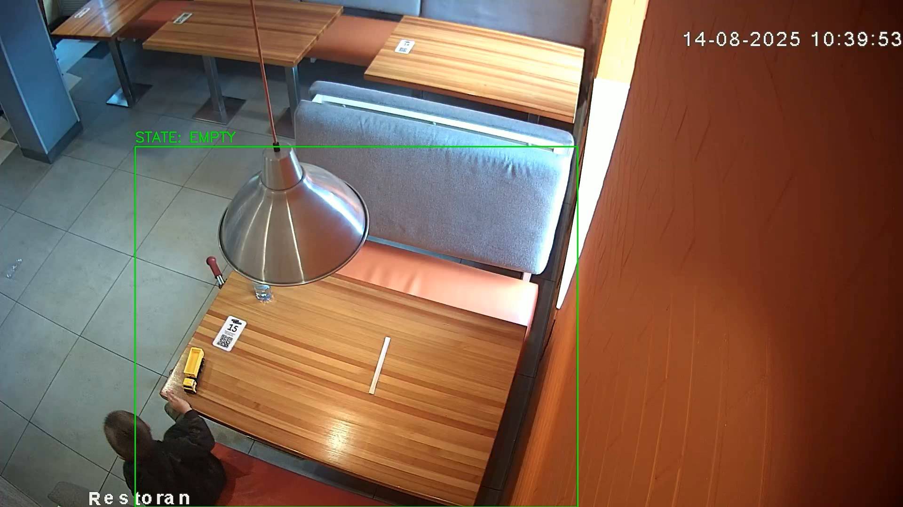

# 🍽️ Table Occupancy Detection System

Прототип системы видеоаналитики для детекции статуса ресторанных столиков (EMPTY / OCCUPIED) и автоматического подсчета времени их простоя под уборку/посадку.

## 🚀 Ключевые архитектурные решения

Задание выполнено с фокусом на создание надежного, Production-ready пайплайна, устойчивого к "шуму" реального мира.

1. **Геометрический фильтр (Bottom-Center Point)**
   Вместо простого пересечения Bounding Box человека и стола (что дает ложные срабатывания от проходящих на переднем плане людей), используется вычисление **BCP (середины нижней грани рамки)**. Система считает, что человек у стола, только если его "ноги" находятся внутри зоны стола (ROI), а площадь пересечения > 50%.
2. **Машина состояний (State Machine) с гистерезисом**
   Для защиты от "мигания" нейросети и естественного поведения гостей реализованы таймеры удержания:
   - `TIME_ENTER` (1.5 - 2.0 сек): Фильтр от "случайных прохожих".
   - `TIME_EXIT` (10.0 - 60.0 сек): Защита от "ложного освобождения" (False Vacancy). Позволяет гостям отойти от стола за салфеткой или поприветствовать друзей, не сбрасывая статус стола.
3. **Two-Pass Processing (Двухпроходная обработка)**
   Скрипт разделяет ресурсоемкую аналитику и рендеринг:
   - *Pass 1 (Analytics)*: Быстрый сбор логов с агрессивным пропуском кадров (YOLO работает каждый 15-й кадр).
   - *Pass 2 (Rendering)*: Молниеносная генерация `output.mp4` на основе собранных событий, без повторного вызова нейросети. Гарантирует идеальную синхронизацию рамки стола со временем видео.

## 🛠 Установка и запуск

1. **Установите зависимости**:
   ```bash
   pip install -r requirements.txt
   ```

2. **Стандартный запуск** — генерирует отчет в консоли и собирает итоговое видео в файл output.mp4 (по умолчанию):
    ```Bash
    python main.py --video path/to/video.mp4
    ```
3. **Сохранение с кастомным именем** — используйте флаг --output, чтобы указать свое имя или путь для итогового видео:
    ```Bash
    python main.py --video path/to/video.mp4 --output my_result.mp4
    ```

4. **Запуск с Live-превью** — показывает работу YOLO и геометрии в реальном времени (работает медленнее):
    ```Bash
    python main.py --video path/to/video.mp4 --preview
    ```

При старте скрипт попросит выделить столик на первом кадре. Выделите стол (желательно захватив зону стульев и пола под ними) и нажмите `ENTER`.

## 📊 Выбор видео и результаты

Для тестирования пайплайна было выбрано **Видео №2**, столик на переднем плане. 
- **Обоснование:** Это видео предоставляет отличные сценарии для тестирования машины состояний. В начале видео за столом длительное время статично сидит человек, что позволяет проверить стабильность удержания статуса `OCCUPIED`. Затем происходит его уход, и система корректно фиксирует освобождение стола. На отметке 6:40 к столу подходит семья, что дает нам второе событие `APPROACH` для расчета статистики.
- **Интересный краевой случай:** На отметке 9:45 семья кратковременно возвращается за вещами. Система не переводит стол обратно в статус `OCCUPIED`, так как их нахождение в зоне длилось меньше заданного порога `TIME_ENTER` (защита от дребезга при коротких касаниях стола).
- **Результат:** Среднее время между уходом первого гостя и подходом следующих составило: **100.6** секунд.

## ⚠️ Ограничения прототипа и Future Work (V2)

В рамках упрощенного прототипа были выявлены следующие архитектурные ограничения, которые могут быть решены в следующих версиях:

- **Ракурсы Bird-Eye (Ограничение YOLO)**: Предобученная на COCO модель YOLOv8n пасует перед искаженной перспективой камер, висящих высоко под потолком (как на Видео №3). Для таких сцен требуется Fine-Tuning модели на специфичном датасете.
- **Длительное отсутствие гостей (Курение)**: Если гость уходит на 5-10 минут, оставив вещи, система по истечении таймера отметит стол как `EMPTY`. Для отличия "Грязного/занятого пустого стола" от "Чистого пустого стола" требуется добавление детектора объектов (Object Detection) для поиска посуды на столе.
- **Оптимизация геометрии (Side-Center Point)**: Текущий алгоритм BCP отлично работает для сидящих гостей. В качестве улучшения (для более быстрой фиксации момента уборки) планируется внедрить проверку **SCP (Side-Center Point)** — середин боковых граней рамки. Это позволит точнее фиксировать соприкосновение уборщика со столом, даже если он физически не заходит ногами в зону ROI.
